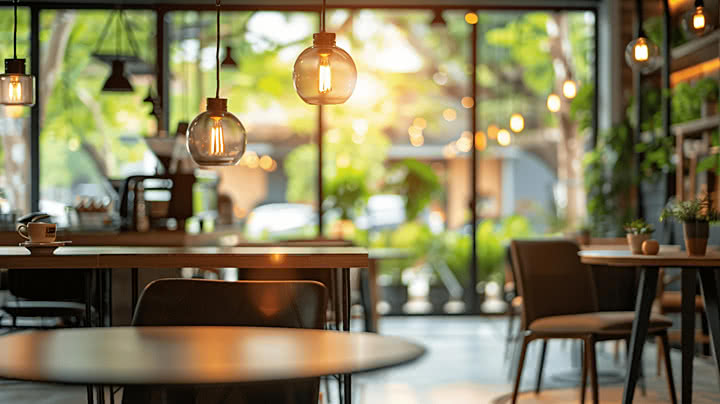

# ☕ Cafe Bliss

A beautifully designed static website for a fictional café — **Cafe Bliss**, made using **HTML**, **CSS**, and hosted with **GitHub Pages**.

---

## 🌐 Live Website
[Visit Cafe Bliss](https://ashlesha2005.github.io)

---

## 📸 Preview

---

## 📁 Project Structure

---

## 🎨 Features

- Fully responsive layout (mobile + desktop)
- Hero section with café intro
- About section with poetic description
- Interactive Menu with categories
- Image gallery
- Contact information
- Soft colors and custom fonts
- Hosted using GitHub Pages

---

## 📦 Tech Stack

- HTML5
- CSS3 (no frameworks)
- Google Fonts
- Git & GitHub Pages

---

## 🙋‍♀️ Creator

**Ashlesha Parte**  
🎓 B.Sc. Computer Science Student  
📸 Aspiring Frontend Dev

---

